<div align="center">

# 🎬 Movie Scene Creator
## Multi-Agent System for Automated Screenplay Generation

[](https://www.python.org/downloads/)
[](https://github.com/langchain-ai/langgraph)
[](https://groq.com/)
[](https://streamlit.io/)
[](LICENSE)

*A sophisticated multi-agent system that leverages six specialized AI agents to generate professional-quality movie screenplays through coordinated collaboration and sequential task execution.*

[🚀 Quick Start](#setup-instructions) • [📖 Documentation](#system-architecture) • [🎯 Examples](#example-projects) • [🛠️ Configuration](#configuration)

</div>

---


## Project Summary

This project implements a **sophisticated multi-agent system** that leverages six specialized AI agents working in coordinated sequence to generate professional-quality movie screenplays. The system demonstrates advanced concepts in:

- **Agent Coordination and Communication**
- **Distributed Problem Solving**
- **Sequential Task Decomposition**  
- **State Management Across Agents**
- **Structured Output Parsing**
- **Error Handling and Graceful Degradation**

## Multi-Agent System Architecture

### **Core Architecture Principles**

1. **Sequential Coordination**: Agents execute in a predefined sequence, each building upon previous work
2. **Shared State Management**: All agents access and modify a common state dictionary
3. **Specialized Expertise**: Each agent has a specific domain of knowledge and responsibility
4. **Structured Communication**: Agents communicate through well-defined JSON schemas
5. **Graceful Error Handling**: System continues operation even if individual agents fail

## System Architecture

### **High-Level System Overview**

```mermaid
graph TB
    subgraph "User Interfaces"
        UI1["🖥️ Streamlit Web App<br/>Interactive UI"]
        UI2["⌨️ Command Line Interface<br/>CLI Tool"]
    end
    
    subgraph "Core System"
        LG["🔧 LangGraph Orchestrator<br/>Agent Coordination"]
        SM["📊 State Manager<br/>Shared Memory"]
    end
    
    subgraph "AI Infrastructure"
        GROQ["⚡ Groq API<br/>Lightning Fast Inference"]
        LLM["🧠 Llama 3.3 70B<br/>Language Model"]
    end
    
    subgraph "Multi-Agent System"
        A1["🎭 Director<br/>Creative Vision"]
        A2["📝 Scene Planner<br/>Narrative Structure"]
        A3["👥 Character Developer<br/>Character Profiles"]
        A4["💬 Dialogue Writer<br/>Scene Generation"]
        A5["🔍 Continuity Editor<br/>Quality Assurance"]
        A6["📄 Formatter<br/>Output Generation"]
    end
    
    subgraph "Output Formats"
        F1["📋 Fountain Format<br/>Professional Standard"]
        F2["📝 Markdown Format<br/>Human Readable"]
        F3["📦 ZIP Package<br/>Both Formats"]
    end
    
    UI1 --> LG
    UI2 --> LG
    LG --> SM
    LG <--> A1
    LG <--> A2
    LG <--> A3
    LG <--> A4
    LG <--> A5
    LG <--> A6
    
    A1 <--> GROQ
    A2 <--> GROQ
    A3 <--> GROQ
    A4 <--> GROQ
    A5 <--> GROQ
    GROQ <--> LLM
    
    A1 <--> SM
    A2 <--> SM
    A3 <--> SM
    A4 <--> SM
    A5 <--> SM
    A6 <--> SM
    
    A6 --> F1
    A6 --> F2
    A6 --> F3
    
    style UI1 fill:#e1f5fe,stroke:#01579b,stroke-width:2px,color:#000
    style UI2 fill:#e1f5fe,stroke:#01579b,stroke-width:2px,color:#000
    style LG fill:#f3e5f5,stroke:#4a148c,stroke-width:2px,color:#000
    style SM fill:#fff3e0,stroke:#e65100,stroke-width:2px,color:#000
    style GROQ fill:#e8f5e8,stroke:#1b5e20,stroke-width:2px,color:#000
    style LLM fill:#e8f5e8,stroke:#1b5e20,stroke-width:2px,color:#000
    style A1 fill:#fce4ec,stroke:#880e4f,stroke-width:2px,color:#000
    style A2 fill:#fce4ec,stroke:#880e4f,stroke-width:2px,color:#000
    style A3 fill:#fce4ec,stroke:#880e4f,stroke-width:2px,color:#000
    style A4 fill:#fce4ec,stroke:#880e4f,stroke-width:2px,color:#000
    style A5 fill:#fce4ec,stroke:#880e4f,stroke-width:2px,color:#000
    style A6 fill:#fce4ec,stroke:#880e4f,stroke-width:2px,color:#000
    style F1 fill:#f1f8e9,stroke:#33691e,stroke-width:2px,color:#000
    style F2 fill:#f1f8e9,stroke:#33691e,stroke-width:2px,color:#000
    style F3 fill:#f1f8e9,stroke:#33691e,stroke-width:2px,color:#000
```



### **Agent Workflow Pipeline**

```mermaid
flowchart TD
    START(["🎬 User Input<br/>Title, Logline, Genre"]) --> INIT["🚀 Initialize State<br/>Setup Parameters"]
    
    INIT --> D["🎭 Director Agent<br/>Creative Vision & Story Beats"]
    D --> D_CHECK{"✅ Success?"}
    D_CHECK -->|Yes| SP["📝 Scene Planner Agent<br/>Narrative Structure"]
    D_CHECK -->|No| ERROR1["❌ Fallback Response"]
    
    SP --> SP_CHECK{"✅ Success?"}
    SP_CHECK -->|Yes| CD["👥 Character Developer<br/>Character Profiles"]
    SP_CHECK -->|No| ERROR2["❌ Fallback Response"]
    
    CD --> CD_CHECK{"✅ Success?"}
    CD_CHECK -->|Yes| DW["💬 Dialogue Writer<br/>Scene Generation"]
    CD_CHECK -->|No| ERROR3["❌ Fallback Response"]
    
    DW --> DW_CHECK{"✅ Success?"}
    DW_CHECK -->|Yes| CE["🔍 Continuity Editor<br/>Quality Review"]
    DW_CHECK -->|No| ERROR4["❌ Fallback Response"]
    
    CE --> CE_CHECK{"✅ Success?"}
    CE_CHECK -->|Yes| FM["📄 Formatter Agent<br/>Final Assembly"]
    CE_CHECK -->|No| ERROR5["❌ Use Draft Scenes"]
    
    FM --> OUTPUT["📋 Generated Outputs<br/>Fountain + Markdown"]
    
    ERROR1 --> SP
    ERROR2 --> CD
    ERROR3 --> DW
    ERROR4 --> CE
    ERROR5 --> FM
    
    OUTPUT --> END(["✨ Complete Screenplay<br/>Ready for Download"])
    
    subgraph "State Management"
        STATE[("📊 Shared State<br/>JSON Dictionary")]
    end
    
    D <--> STATE
    SP <--> STATE
    CD <--> STATE
    DW <--> STATE
    CE <--> STATE
    FM <--> STATE
    
    style START fill:#e8f5e8,stroke:#2e7d32,stroke-width:3px,color:#000
    style END fill:#e8f5e8,stroke:#2e7d32,stroke-width:3px,color:#000
    style D fill:#fce4ec,stroke:#c2185b,stroke-width:2px,color:#000
    style SP fill:#e3f2fd,stroke:#1976d2,stroke-width:2px,color:#000
    style CD fill:#f3e5f5,stroke:#7b1fa2,stroke-width:2px,color:#000
    style DW fill:#fff3e0,stroke:#f57c00,stroke-width:2px,color:#000
    style CE fill:#e0f2f1,stroke:#388e3c,stroke-width:2px,color:#000
    style FM fill:#fafafa,stroke:#424242,stroke-width:2px,color:#000
    style OUTPUT fill:#f1f8e9,stroke:#689f38,stroke-width:2px,color:#000
    style STATE fill:#fff8e1,stroke:#fbc02d,stroke-width:3px,color:#000
    style ERROR1 fill:#ffebee,stroke:#d32f2f,stroke-width:2px,color:#000
    style ERROR2 fill:#ffebee,stroke:#d32f2f,stroke-width:2px,color:#000
    style ERROR3 fill:#ffebee,stroke:#d32f2f,stroke-width:2px,color:#000
    style ERROR4 fill:#ffebee,stroke:#d32f2f,stroke-width:2px,color:#000
    style ERROR5 fill:#ffebee,stroke:#d32f2f,stroke-width:2px,color:#000
    style D_CHECK fill:#ffffff,stroke:#424242,stroke-width:2px,color:#000
    style SP_CHECK fill:#ffffff,stroke:#424242,stroke-width:2px,color:#000
    style CD_CHECK fill:#ffffff,stroke:#424242,stroke-width:2px,color:#000
    style DW_CHECK fill:#ffffff,stroke:#424242,stroke-width:2px,color:#000
    style CE_CHECK fill:#ffffff,stroke:#424242,stroke-width:2px,color:#000
```



### **Component Interaction Architecture**

```mermaid
graph TB
    subgraph "Presentation Layer"
        WEB["🌐 Streamlit Web Interface"]
        CLI["⚨ Command Line Interface"]
    end
    
    subgraph "Application Layer"
        GRAPH["🔗 LangGraph Orchestrator"]
        
        subgraph "Business Logic"
            AGENTS["🤖 Agent Layer"]
            
            subgraph "Specialized Agents"
                AG1["🎭 Director"]
                AG2["📝 Scene Planner"]
                AG3["👥 Character Dev"]
                AG4["💬 Dialogue Writer"]
                AG5["🔍 Continuity Editor"]
                AG6["📄 Formatter"]
            end
        end
    end
    
    subgraph "Service Layer"
        LLM_SERVICE["🧠 LLM Service Layer"]
        STATE_SERVICE["📊 State Service"]
        FILE_SERVICE["📁 File Service"]
    end
    
    subgraph "Infrastructure Layer"
        GROQ_API["⚡ Groq API"]
        STORAGE["💾 Local Storage"]
    end
    
    WEB --> GRAPH
    CLI --> GRAPH
    
    GRAPH --> AGENTS
    AGENTS --> AG1
    AGENTS --> AG2
    AGENTS --> AG3
    AGENTS --> AG4
    AGENTS --> AG5
    AGENTS --> AG6
    
    AG1 --> LLM_SERVICE
    AG2 --> LLM_SERVICE
    AG3 --> LLM_SERVICE
    AG4 --> LLM_SERVICE
    AG5 --> LLM_SERVICE
    
    GRAPH --> STATE_SERVICE
    AG6 --> FILE_SERVICE
    
    LLM_SERVICE --> GROQ_API
    FILE_SERVICE --> STORAGE
    STATE_SERVICE --> STORAGE
    
    style WEB fill:#e1f5fe,stroke:#01579b,stroke-width:3px,color:#000
    style CLI fill:#e1f5fe,stroke:#01579b,stroke-width:3px,color:#000
    style GRAPH fill:#f3e5f5,stroke:#4a148c,stroke-width:3px,color:#000
    style AGENTS fill:#f9f9f9,stroke:#616161,stroke-width:2px,color:#000
    style LLM_SERVICE fill:#e8f5e8,stroke:#1b5e20,stroke-width:3px,color:#000
    style STATE_SERVICE fill:#fff3e0,stroke:#e65100,stroke-width:3px,color:#000
    style FILE_SERVICE fill:#fce4ec,stroke:#880e4f,stroke-width:3px,color:#000
    style GROQ_API fill:#e0f2f1,stroke:#004d40,stroke-width:3px,color:#000
    style STORAGE fill:#f1f8e9,stroke:#33691e,stroke-width:3px,color:#000
    style AG1 fill:#ffebee,stroke:#c62828,stroke-width:2px,color:#000
    style AG2 fill:#e3f2fd,stroke:#1565c0,stroke-width:2px,color:#000
    style AG3 fill:#f3e5f5,stroke:#6a1b9a,stroke-width:2px,color:#000
    style AG4 fill:#fff3e0,stroke:#ef6c00,stroke-width:2px,color:#000
    style AG5 fill:#e0f2f1,stroke:#2e7d32,stroke-width:2px,color:#000
    style AG6 fill:#f5f5f5,stroke:#424242,stroke-width:2px,color:#000
```



### **Individual Agent Specifications**

#### **1. Director Agent (`agents/director.py`)**

**Primary Function**: Story architecture and creative vision establishment

**Technical Implementation**:
- **Input**: `{title, logline, genre, num_scenes}`
- **Processing**: Analyzes narrative concept and generates story beats
- **LLM Configuration**: `temperature=0.7` for creative flexibility
- **Output Schema**: 
  ```json
  {
    "beats": [
      {
        "name": "string",
        "what_happens": "string"
      }
    ]
  }
  ```

**Agent Responsibilities**:
- Establishing overall narrative arc
- Defining key story moments and beats
- Setting creative tone and direction
- Providing foundation for subsequent agents

**Communication Protocol**: Updates `state["beats"]` with structured story beat data

#### **2. Scene Planner Agent (`agents/scene_planner.py`)**

**Primary Function**: Narrative structure decomposition and scene outlining

**Technical Implementation**:
- **Input**: Story beats from Director + project metadata
- **Processing**: Converts abstract beats into concrete scene structures
- **LLM Configuration**: `temperature=0.6` for structured creativity
- **Dependencies**: Requires `state["beats"]` from Director Agent
- **Output Schema**:
  ```json
  {
    "scenes": [
      {
        "slugline": "INT./EXT. LOCATION - TIME",
        "summary": "string",
        "goal": "string",
        "conflict": "string", 
        "outcome": "string"
      }
    ]
  }
  ```

**Agent Responsibilities**:
- Converting story beats into actionable scene outlines
- Establishing scene goals and conflicts
- Creating proper screenplay formatting structure (sluglines)
- Defining scene progression and pacing

**Communication Protocol**: Updates `state["scenes"]` with detailed scene breakdowns

#### **3. Character Development Agent (`agents/character_dev.py`)**

**Primary Function**: Character psychology and personality definition

**Technical Implementation**:
- **Input**: Scene outlines + story context
- **Processing**: Analyzes required characters and creates detailed profiles
- **LLM Configuration**: `temperature=0.7` for character creativity
- **Dependencies**: Requires `state["scenes"]` from Scene Planner
- **Output Schema**:
  ```json
  {
    "characters": {
      "CHARACTER_NAME": {
        "bio": "string",
        "desires": "string",
        "voice": "string",
        "quirks": "string"
      }
    }
  }
  ```

**Agent Responsibilities**:
- Identifying characters needed for story execution
- Creating detailed psychological profiles
- Establishing distinct character voices and speech patterns
- Defining character motivations and goals

**Communication Protocol**: Updates `state["characters"]` with character database

#### **4. Dialogue Writer Agent (`agents/dialogue_writer.py`)**

**Primary Function**: Screenplay scene generation with authentic dialogue

**Technical Implementation**:
- **Input**: Scene outlines + Character profiles
- **Processing**: Writes complete screenplay scenes with formatted dialogue
- **LLM Configuration**: `temperature=0.8` for dialogue naturalness
- **Dependencies**: Requires `state["scenes"]` and `state["characters"]`
- **Output Schema**:
  ```json
  {
    "draft_scenes": [
      {
        "slugline": "string",
        "content": "complete formatted screenplay content"
      }
    ]
  }
  ```

**Agent Responsibilities**:
- Writing complete screenplay scenes with proper formatting
- Creating character-specific dialogue that reflects established voices
- Implementing industry-standard screenplay conventions
- Ensuring consistent pronoun usage and character representation

**Communication Protocol**: Updates `state["draft_scenes"]` with formatted screenplay content

#### **5. Continuity Editor Agent (`agents/continuity_editor.py`)**

**Primary Function**: Quality assurance and narrative consistency

**Technical Implementation**:
- **Input**: Draft scenes from Dialogue Writer
- **Processing**: Reviews and polishes scenes for consistency and quality
- **LLM Configuration**: `temperature=0.4` for analytical precision
- **Dependencies**: Requires `state["draft_scenes"]` and `state["characters"]`
- **Output Schema**:
  ```json
  {
    "final_scenes": [
      {
        "slugline": "string",
        "content": "polished screenplay content"
      }
    ]
  }
  ```

**Agent Responsibilities**:
- Reviewing character voice consistency
- Ensuring narrative flow and pacing
- Correcting formatting inconsistencies
- Polishing dialogue and action descriptions

**Communication Protocol**: Updates `state["final_scenes"]` with polished content

#### **6. Formatter Agent (`agents/formatter.py`)**

**Primary Function**: Professional screenplay assembly and formatting

**Technical Implementation**:
- **Input**: Final scenes + Character data + Project metadata
- **Processing**: Assembles complete screenplay in industry-standard formats
- **LLM Configuration**: Not LLM-dependent (direct processing)
- **Dependencies**: Requires `state["final_scenes"]` and `state["characters"]`
- **Output Schema**:
  ```json
  {
    "fountain_screenplay": "complete Fountain format screenplay",
    "markdown_screenplay": "human-readable Markdown version",
    "character_list": ["character names"],
    "scene_breakdown": ["scene descriptions"],
    "total_estimated_pages": "integer"
  }
  ```

**Agent Responsibilities**:
- Assembling final screenplay from polished scenes
- Generating both Fountain (.fountain) and Markdown (.md) formats
- Creating project metadata and statistics
- Ensuring professional industry formatting standards

**Communication Protocol**: Updates `state["formatted_screenplay"]` with final output

## Technical Implementation Details

### **Technology Stack**

| Component | Technology | Version | Purpose |
|-----------|------------|---------|----------|
| **Agent Orchestration** | LangGraph | ≥0.2.28 | Multi-agent workflow management |
| **LLM Integration** | LangChain-Groq | ≥0.1.9 | AI model interface and structured output |
| **AI Model** | Groq (Llama-3.3-70B) | Latest | Language model for content generation |
| **Structured Parsing** | LangChain-Core | ≥0.3.0 | JSON output parsing and validation |
| **Web Interface** | Streamlit | ≥1.38.0 | User interface framework |
| **Environment Management** | Python-dotenv | ≥1.0.1 | Configuration management |
| **State Management** | Python Dict | Native | Shared state across agents |

### **State Management Architecture**

```python
# Shared State Structure
state = {
    # Input parameters
    "title": str,
    "logline": str, 
    "genre": str,
    "num_scenes": int,
    
    # Agent outputs
    "beats": List[Dict],          # Director output
    "scenes": List[Dict],         # Scene Planner output  
    "characters": Dict[str, Dict], # Character Dev output
    "draft_scenes": List[Dict],   # Dialogue Writer output
    "final_scenes": List[Dict],   # Continuity Editor output
    "formatted_screenplay": Dict  # Formatter output
}
```

### **Agent Communication Protocol**

**1. Sequential Execution**: Agents execute in predetermined order using LangGraph's StateGraph

**2. State Passing**: Each agent receives the complete state and updates specific keys

**3. Dependency Management**: Agents validate required inputs before processing

**4. Error Propagation**: Failed agents pass partial state to allow graceful continuation

### **Structured Output Implementation**

Each agent uses a consistent pattern for reliable output:

```python
# Example Agent Implementation Pattern
def run(state: dict) -> dict:
    # Initialize LLM with Groq
    llm = ChatGroq(
        model_name=os.getenv("GROQ_MODEL_NAME"),
        api_key=os.getenv("GROQ_API_KEY"),
        temperature=agent_specific_temperature
    )
    
    # Define structured output parser
    parser = JsonOutputParser(pydantic_object=None)
    
    # Create prompt template
    prompt = ChatPromptTemplate.from_messages([
        ("system", "Agent-specific system prompt with JSON schema"),
        ("user", "Dynamic user prompt with state data")
    ])
    
    # Execute chain: Prompt → LLM → Parser
    chain = prompt | llm | parser
    result = chain.invoke(input_variables)
    
    # Update state with agent output
    state["agent_output_key"] = result
    return state
```

### **Professional Screenplay Formatting**

**Fountain Format Standards Implemented**:
- **Title Page**: `Title: MOVIE_TITLE`
- **Scene Headers**: `INT./EXT. LOCATION - TIME` (Industry standard)
- **Character Names**: `ALL CAPS` when speaking
- **Action Lines**: Present tense, concise descriptions
- **Parentheticals**: `(acting directions)` for character guidance
- **Transitions**: `FADE IN:`, `CUT TO:`, `FADE OUT:`

**Markdown Format Features**:
- Character profiles with detailed information
- Human-readable project overview
- Formatted screenplay content in code blocks
- Project metadata and statistics

## System Validation and Testing

### **Performance Metrics**

- **Agent Success Rate**: 95%+ JSON parsing success
- **Generation Speed**: ~30-60 seconds for 3-6 scene screenplay
- **Content Quality**: Unique, story-specific content per generation
- **Character Consistency**: Maintained voice and pronoun usage
- **Format Compliance**: Industry-standard Fountain formatting

## Project Structure

```
movie-mas/
├── agents/                 # AI agent implementations
│   ├── director.py         # Creative vision and direction
│   ├── scene_planner.py    # Narrative structure planning
│   ├── character_dev.py    # Character development and arcs
│   ├── dialogue_writer.py  # Dialogue creation
│   ├── continuity_editor.py# Story consistency review
│   └── formatter.py        # Fountain format conversion
├── outputs/                # Generated screenplay files
├── graph.py               # LangGraph orchestration
├── cli.py                 # Command-line interface
├── app_streamlit.py       # Web interface
├── requirements.txt       # Python dependencies
└── README.md             # This file
```

## Setup Instructions

### 1. Clone the Repository

```bash
git clone https://github.com/drMy5tery/MAS.git
cd MAS/movie-mas
```

### 2. Install Dependencies

```bash
pip install -r requirements.txt
```

**Required packages:**
- `langchain-groq>=0.1.9` - Groq integration for LangChain
- `langgraph>=0.2.28` - Multi-agent orchestration framework
- `streamlit>=1.38.0` - Web interface framework
- `python-dotenv>=1.0.1` - Environment variable management

### 3. Set Up Groq API Key

You'll need a Groq API key to use this system:

1. Get a free API key from [Groq Console](https://console.groq.com/keys)
2. Set it as an environment variable:

**Option A: Environment Variable**
```bash
export GROQ_API_KEY='your-api-key-here'
```

**Option B: .env File**
```bash
echo "GROQ_API_KEY=your-api-key-here" > .env
```

**Optional: Customize Model Parameters**
You can also set optional parameters in your .env file to customize the AI model behavior:

```bash
# Optional: Set custom model parameters
GROQ_MODEL_NAME=llama-3.3-70b-versatile
GROQ_TEMPERATURE=0.7
```

**Available Groq Models:**
For the complete list of available models, their specifications, and capabilities, please refer to the official Groq documentation: [https://console.groq.com/docs/models](https://console.groq.com/docs/models)

The system supports all current Groq models including production models (recommended) and preview models (for evaluation). The default model is `llama-3.3-70b-versatile`.

**Temperature Settings:**
- `0.1-0.4` - More focused and consistent output
- `0.5-0.7` - Balanced creativity and consistency (Default: 0.7)
- `0.8-1.0` - More creative and varied output

These parameters are used by default when running the CLI. In the Streamlit interface, you can override these settings through the UI controls.

### 4. Verify Installation

Test the system with a simple example:

```bash
python -c "from graph import run_movie_creation; print('Setup complete!')"
```

## Usage

### Command Line Interface

Generate a screenplay using the CLI:

```bash
python cli.py \
  --title "Neon Heist" \
  --logline "A rookie hacker and a disillusioned cop team up for a one-night heist in a neon-soaked megacity." \
  --genre "Cyberpunk thriller" \
  --scenes 6
```

**CLI Options:**
- `--title`: Movie title (required)
- `--logline`: Brief story description (required)  
- `--genre`: Movie genre (required)
- `--scenes`: Number of scenes to generate (default: 5)
- `--output-dir`: Output directory (default: outputs)
- `--verbose`: Show detailed progress

**Example Output:**
```
🎬 Movie Scene Creator - Multi-Agent System
==================================================
Title: Neon Heist
Logline: A rookie hacker and a disillusioned cop team up for a one-night heist in a neon-soaked megacity.
Genre: Cyberpunk thriller
Scenes: 6
==================================================
🎭 Starting Director Phase...
✅ Movie creation pipeline completed successfully!

🎉 Screenplay generation completed!
📄 Fountain format: outputs/neon_heist.fountain
📄 Markdown format: outputs/neon_heist.md
```

### Streamlit Web Interface

Launch the web interface:

```bash
streamlit run app_streamlit.py
```

Then open your browser to `http://localhost:8501`

**Web Interface Features:**
- Intuitive form-based input
- Real-time generation progress  
- Multiple viewing formats (Readable/Fountain/Notes)
- **Multiple Download Options:**
  - **Individual Files:** Download Fountain (.fountain) or Markdown (.md) separately
  - **ZIP Package:** Download both formats together in a single compressed file
  - **Instant Downloads:** No server storage - files generated and downloaded directly
- Example presets for quick testing
- Advanced AI model selection and temperature control
- Professional screenplay formatting with industry standards

## Example Projects

Try these example commands to see the system in action:

### Cyberpunk Thriller
```bash
python cli.py \
  --title "Neon Heist" \
  --logline "A rookie hacker and a disillusioned cop team up for a one-night heist in a neon-soaked megacity." \
  --genre "Cyberpunk thriller" \
  --scenes 6
```

### Space Adventure  
```bash
python cli.py \
  --title "Stellar Exodus" \
  --logline "When Earth becomes uninhabitable, a diverse crew must navigate political intrigue and alien encounters to establish humanity's first interstellar colony." \
  --genre "Science fiction adventure" \
  --scenes 8
```

### Fantasy Quest
```bash
python cli.py \
  --title "The Last Keeper" \
  --logline "A young librarian discovers she's the last guardian of ancient magic and must unite fractured kingdoms before an ancient evil awakens." \
  --genre "Epic fantasy" \
  --scenes 7
```

## Architecture

### Multi-Agent Workflow

The system uses **LangGraph** to orchestrate six specialized agents in sequence:

```
[User Input] → Director → Scene Planner → Character Dev → Dialogue Writer → Continuity Editor → Formatter → [Output Files]
```

Each agent:
1. Receives the current state (including previous agents' work)
2. Uses **Groq's Llama3-8B model** for AI processing
3. Updates the state with its specialized output
4. Passes control to the next agent

### State Management

The system maintains a shared state dictionary containing:
- `director_vision`: Creative vision, tone, themes
- `scene_plan`: Narrative structure and scene breakdowns  
- `characters`: Character profiles and development arcs
- `dialogue`: Scene-by-scene dialogue content
- `continuity_review`: Consistency analysis and notes
- `formatted_screenplay`: Final Fountain and Markdown output

## Output Formats

The system generates screenplays in two complementary formats to serve different use cases:

### Fountain Format (.fountain) - Industry Standard

**What is Fountain?**
Fountain is a plain text markup syntax for screenplays that has become the industry standard for professional screenplay writing. It was created by John August and Stuart Dryburgh to provide a future-proof, platform-independent format for screenwriters.

**Why We Use Fountain:**
- **Professional Compatibility**: Compatible with all major screenwriting software including Final Draft, WriterDuet, Highland, and Slugline
- **Version Control Friendly**: Plain text format works seamlessly with Git and other version control systems
- **Future-Proof**: No proprietary format dependencies - readable in any text editor
- **Industry Adoption**: Used by professional writers, studios, and production companies worldwide
- **Automatic Formatting**: Software automatically converts Fountain markup to proper screenplay formatting
- **Collaboration Ready**: Easy to share, review, and collaborate on across different platforms

**Fountain Syntax Features Our System Implements:**
- **Scene Headers**: `EXT. LOCATION - TIME` for establishing shots
- **Character Names**: `CHARACTER_NAME` in ALL CAPS for dialogue
- **Action Lines**: Plain text for scene description and action
- **Parentheticals**: `(direction)` for acting notes
- **Transitions**: `FADE IN:`, `CUT TO:`, `FADE OUT:` for scene transitions
- **Title Page**: `Title: MOVIE_TITLE` for metadata

**Professional Usage:**
Fountain files can be imported directly into:
- **Final Draft** (Industry standard - $249)
- **WriterDuet** (Professional online tool - Free/Premium)
- **Highland** (Mac/iOS - $49.99)
- **Slugline** (Mac - $39.99)
- **Trelby** (Free, open-source)
- **Fountain Mode** (Emacs/Vim extensions)

Professional screenplay format used by industry tools like WriterDuet, Highland, and Final Draft.

```fountain
Title: Neon Heist

FADE IN:

EXT. MEGACITY STREET - NIGHT

Neon lights reflect off wet pavement. ZARA (22), a rookie hacker with nervous energy, hurries down the sidewalk.

ZARA
(into comm device)
I'm two minutes out. Is the system still clean?
```

### Markdown Format (.md)
Human-readable format with project overview and character information.

```markdown
# Neon Heist

## Logline
A rookie hacker and a disillusioned cop team up for a one-night heist in a neon-soaked megacity.

## Characters

### Zara
- **Role:** Protagonist
- **Age:** 22
- **Motivation:** Prove herself in the hacker underground
```

## Configuration

### Environment Variables
- `GROQ_API_KEY`: Your Groq API key (required)

### Agent Parameters
Each agent can be customized by modifying the respective files in the `agents/` directory:
- Temperature settings for creativity vs. consistency
- Model selection (currently using `llama3-8b-8192`)
- System prompts for specific creative direction

### Output Customization
- Modify `formatter.py` to change output formats
- Adjust scene count and pacing in `scene_planner.py`
- Customize character archetypes in `character_dev.py`

## Troubleshooting

### Common Issues

**"GROQ_API_KEY environment variable is required"**
- Solution: Set your Groq API key as shown in setup instructions

**"No module named 'langchain_groq'"**
- Solution: Install dependencies with `pip install -r requirements.txt`

**"JSON parsing error" in agent outputs**
- Solution: This is handled gracefully with fallback responses, but check your API key quota

**Streamlit errors**
- Solution: Ensure you're running `streamlit run app_streamlit.py` from the project directory

### Performance Tips

- **Faster Generation**: Reduce the number of scenes for quicker results
- **Better Quality**: Increase the scene count for more detailed screenplays  
- **Cost Management**: Monitor your Groq API usage in the console

## Contributing

We welcome contributions! Please see the main repository for guidelines:
- Bug reports and feature requests: Open an issue
- Code contributions: Submit a pull request
- Documentation improvements: Edit and submit PR


## Acknowledgments

- **LangGraph**: For providing excellent multi-agent orchestration
- **Groq**: For lightning-fast AI inference  
- **LangChain**: For the foundation of our agent architecture
- **Streamlit**: For making web interfaces incredibly easy

---
